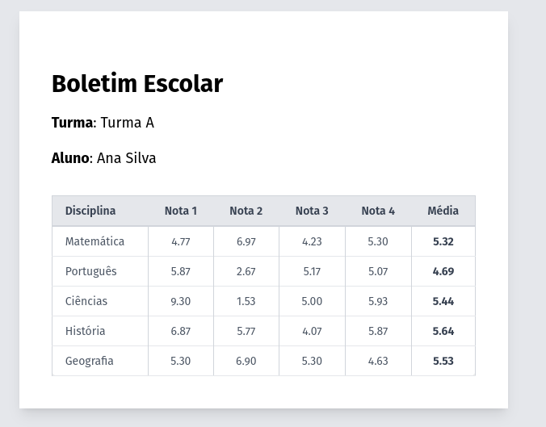

# desafio_tecnico_dev_backend

Este teste técnico avalia os seguintes pontos do candidato: Lógica, capacidade de resolver problemas, manuseio da tecnologia laravel, docker e entendimento de SQL. 

O desafio é cronometrado e terá duração de 1 hora.


**Importante: candidato já deve vir com o projeto configurado em sua máquina**


# 1 desafio (Lógica de programação)
O candidato pode escolher entre os 2 problemas para resolver.

## Problema 1
Dado um array de números inteiros e um número alvo (target), escreva uma função que encontre dois números no array que somem exatamente ao valor do alvo. A função deve retornar os índices desses dois números.
**Exemplo:**
```
Entrada: nums = [2, 7, 11, 15], target = 9
Saída: [0, 1]
Explicação: nums[0] + nums[1] = 2 + 7 = 9
```
```php

function twoSum(array $nums, int $target): array {
    
    // Retorna vazio s não achar os números
    return [];
}

$nums = [2, 7, 11, 15];
$target = 9;
$result = twoSum($nums, $target);
print_r($result); // Output: [0, 1]
```

### Problema 2 
Escreva uma função em PHP que determine se uma string é um palíndromo. Um palíndromo é uma palavra, frase, número ou qualquer outra sequência de caracteres que leia da mesma forma de trás para frente (desconsiderando espaços, pontuação e diferenças entre maiúsculas e minúsculas).

**Exemplo**:

```

Entrada: "A man a plan a canal Panama"
Saída: true

Entrada: "Ana"
Saída: true

Entrada: "Hello"
Saída: false
```

```php
function isPalindrome(string $str): bool {
 
}

echo isPalindrome("A man a plan a canal Panama") ? 'true' : 'false'; // Output: true
echo "\n";
echo isPalindrome("Hello") ? 'true' : 'false'; // Output: false
```

## Desafio 2
Nesse etapa vamos testar algumas das suas habilidades com SQL, Laravel e lógica.

Instruções: Instale o projeto com o comando `instala_projeto.sh`
não esqueça de rodar as migrations e as seeds

Altere a coluna `minimal_disciplines_to_advance_to_next_class` de forma que a turma com id 1 tenha no mínimo 4 disciplinas para o aluno poder passar de ano.
Em seguinda crie um novo cálculo onde a nota cálculada será uma média ponderada com peso `3.5`.

na rota `/boletim/1` você deve conseguir ver o seguinte boletim:




